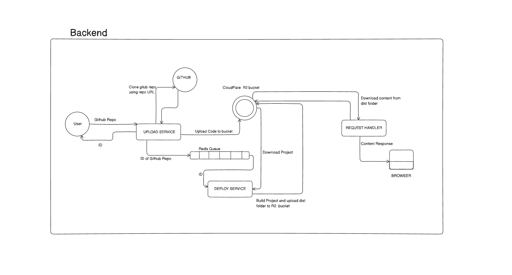

RUN BUILD - npx tsc -b
RUN PROJECT - node dist/index.js

# Vercel Clone Application

This application is similar to Vercel which provides the user with a service to deploy their project remotely using github repo Url.

## Backend System Design
##### URL - https://app.eraser.io/workspace/OoR3Adc2bDEWQI5GJtyG?origin=share

## Postman API

 Online

## Description

